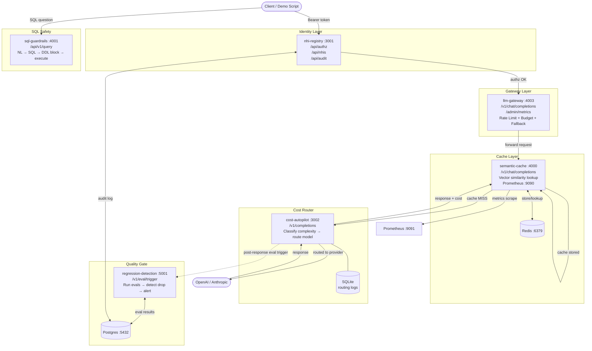

# Architecture — AI Control Plane
> Last updated: 2026-08-29 | Maturity: Full Prototype
> _End-to-end AI request lifecycle with identity, rate-limiting, semantic caching, cost routing, and regression evaluation._

## System Architecture

## Component Overview

| Component | Port | Description | Tech |
|---|---|---|---|
| `nhi-registry` | `3001` | Non-human identity and policy enforcement. | Node.js |
| `llm-gateway` | `4003` | API gateway for rate limiting, budgets, and fallbacks. | Node.js |
| `semantic-cache` | `4000` | Semantic caching proxy exposing Prometheus metrics (`:9090`). | Node.js / Python |
| `cost-autopilot` | `3002` | Cost classifier and model router. | Node.js / Python |
| `sql-guardrails` | `4001` | SQL generation with DDL guardrails. | Node.js / Python |
| `regression-detection` | `5001` | Evaluation runner and regression alert system. | Node.js / Python |
| `prometheus` | `9091` | Metrics scraper. | Go |

## External Dependencies

| Dependency | Status | Notes |
|---|---|---|
| OpenAI API | **Real** | Used by router for `gpt-4o` and `gpt-4o-mini` routing unless stubbed. |
| Postgres | **Real** | Shared infra DB for NHI identity and regression evaluation. |
| Redis | **Real** | Shared infra caching backend for the semantic cache. |
